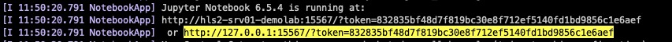

# Train BridgeTower on Habana Gaudi2

### Instructions
1.  Run the notebook:


* SSH into habana-demo:
```
ssh demo@198.175.88.52

```

* Attach to tmux session:
```
tmux new-session -s notebook_2
```

* Enter the container:
```
docker exec -it BT_workshop bash
```

* Change directory to:
```
cd ai.gaudi_training
```

* Launch Jupyter Notebook:
```
jupyter notebook --port=15566 --ip 0.0.0.0 --allow-root
```


2.  To open the notebook in a browser:

* Connect to devcloud with port-forwarding (From your local machine):
```
ssh -L 15566:127.0.0.1:15566 -L 15567:127.0.0.1:15567 -L 15568:127.0.0.1:15568 -L 15569:127.0.0.1:15569 demo@198.175.88.52
```

* Copy the link the it gives you and open the link in your browser.
  For example:
  
  


# Links

[optimum-habana](https://github.com/huggingface/optimum-habana/blob/main/examples/contrastive-image-text/run_bridgetower.py)

[GaudiTrainingArguments](https://github.com/huggingface/optimum-habana/blob/873fe7c9de3c1a2e60cc0aab2d1ef2fcf04d2f0c/optimum/habana/transformers/training_args.py#L75)

[GaudiConfig](https://github.com/huggingface/optimum-habana/blob/873fe7c9de3c1a2e60cc0aab2d1ef2fcf04d2f0c/optimum/habana/transformers/gaudi_configuration.py#L50)

[GaudiTrainer](https://github.com/huggingface/optimum-habana/blob/873fe7c9de3c1a2e60cc0aab2d1ef2fcf04d2f0c/optimum/habana/transformers/trainer.py#L121)

[BridgeTower docs](https://huggingface.co/docs/transformers/v4.30.0/en/model_doc/bridgetower#transformers.BridgeTowerForContrastiveLearning)

[BridgeTower paper](https://arxiv.org/pdf/2206.08657.pdf)


[BridgeTower slides](https://docs.google.com/presentation/d/1HmInkvoe1rneBX2cp2uSNFGRP9aELn6H/edit?usp=sharing&ouid=108516460565676354775&rtpof=true&sd=true)


